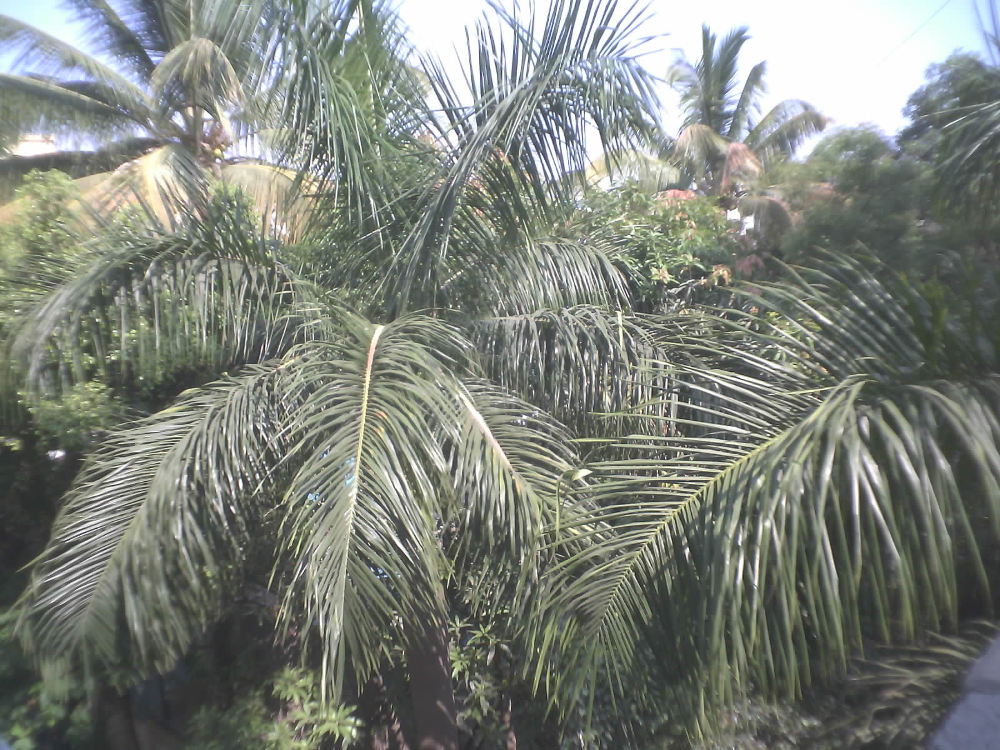
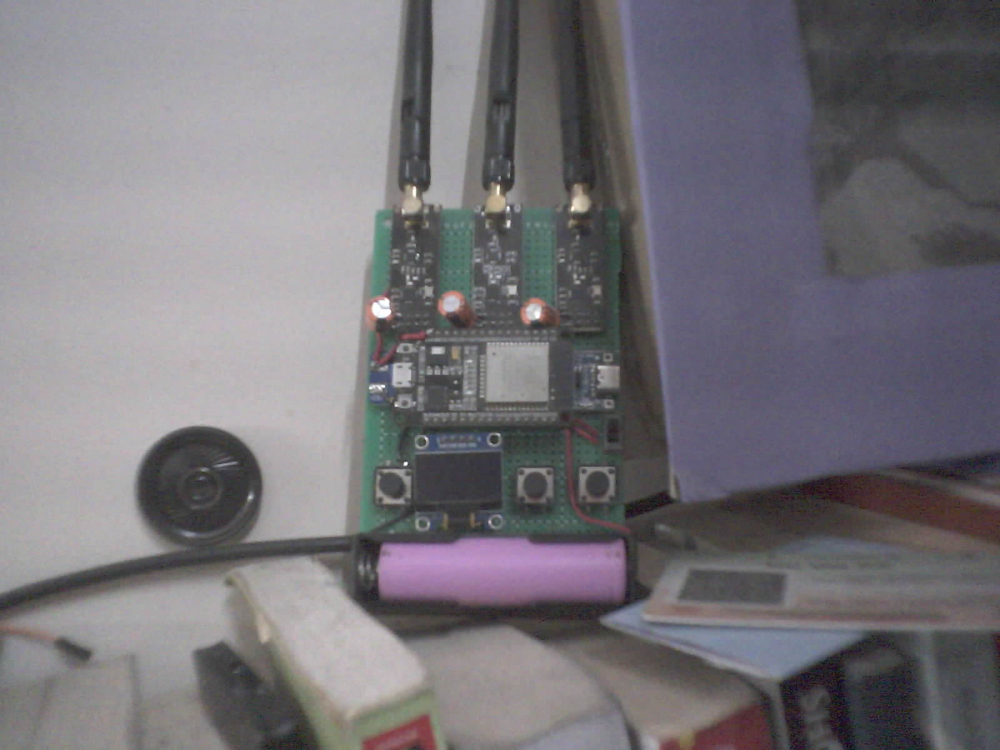
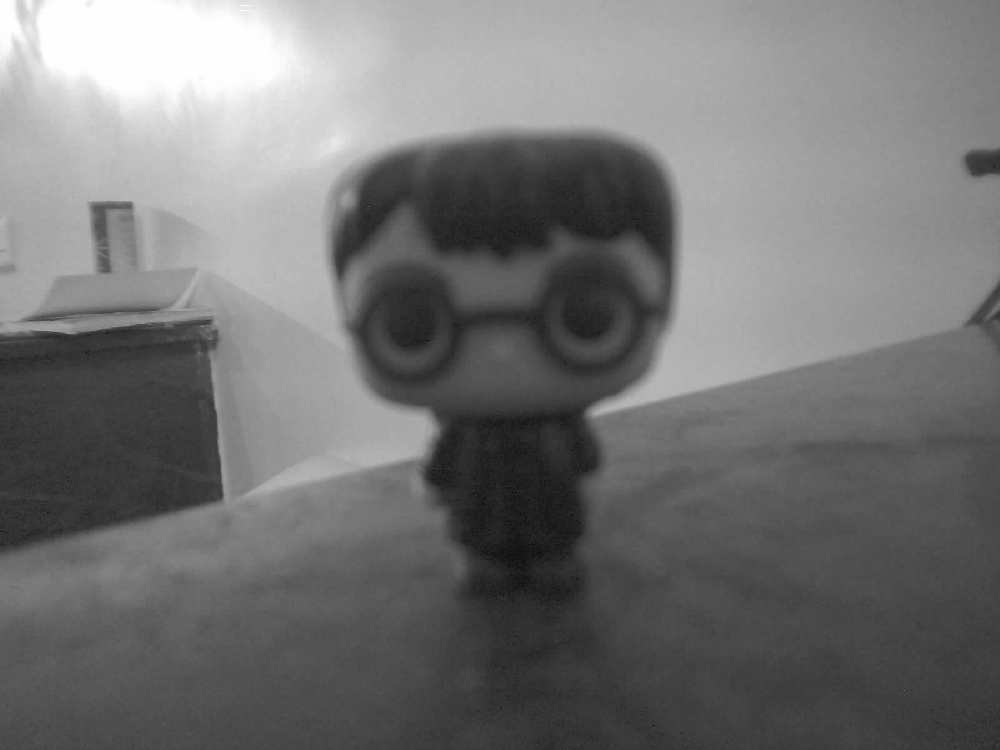
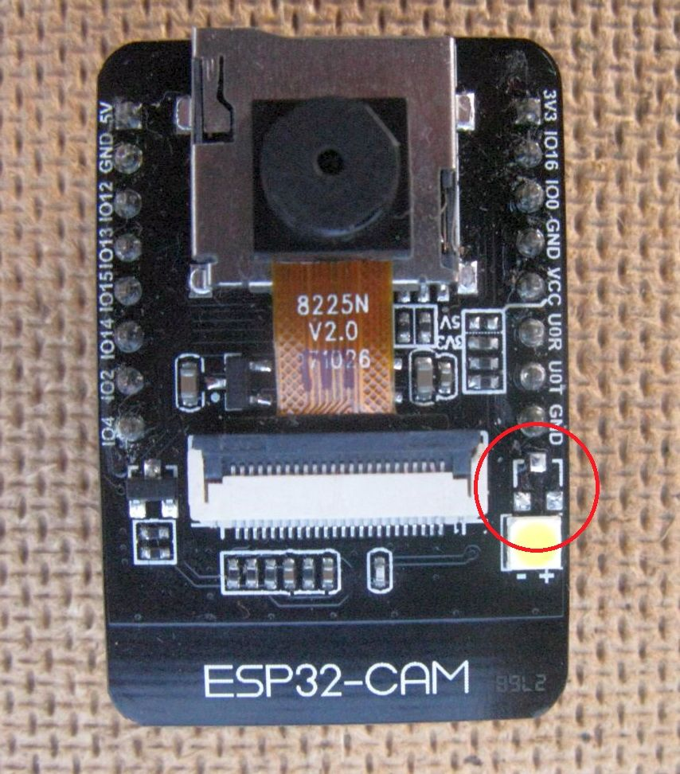
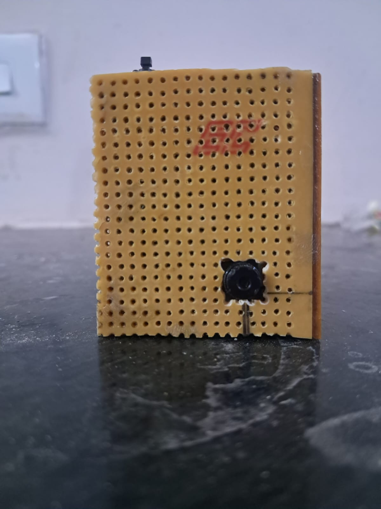
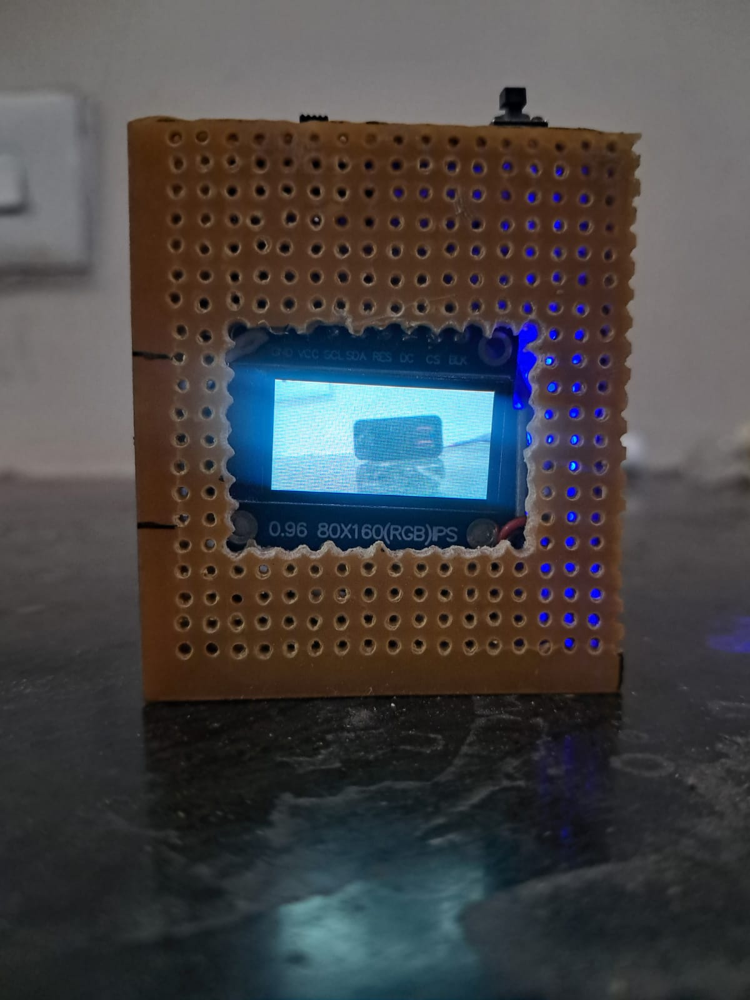
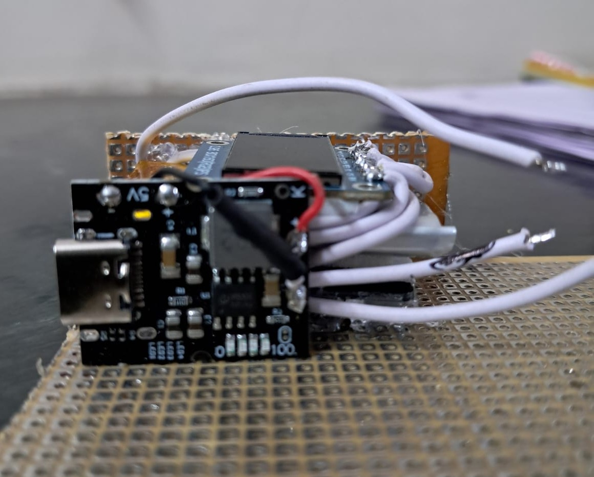
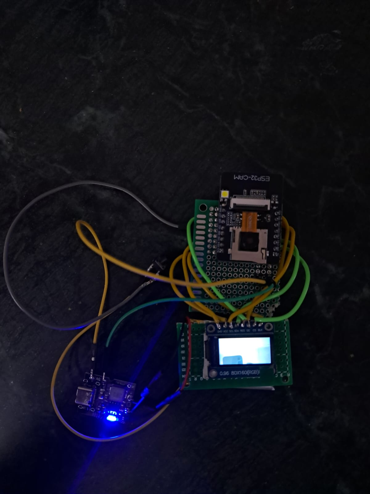
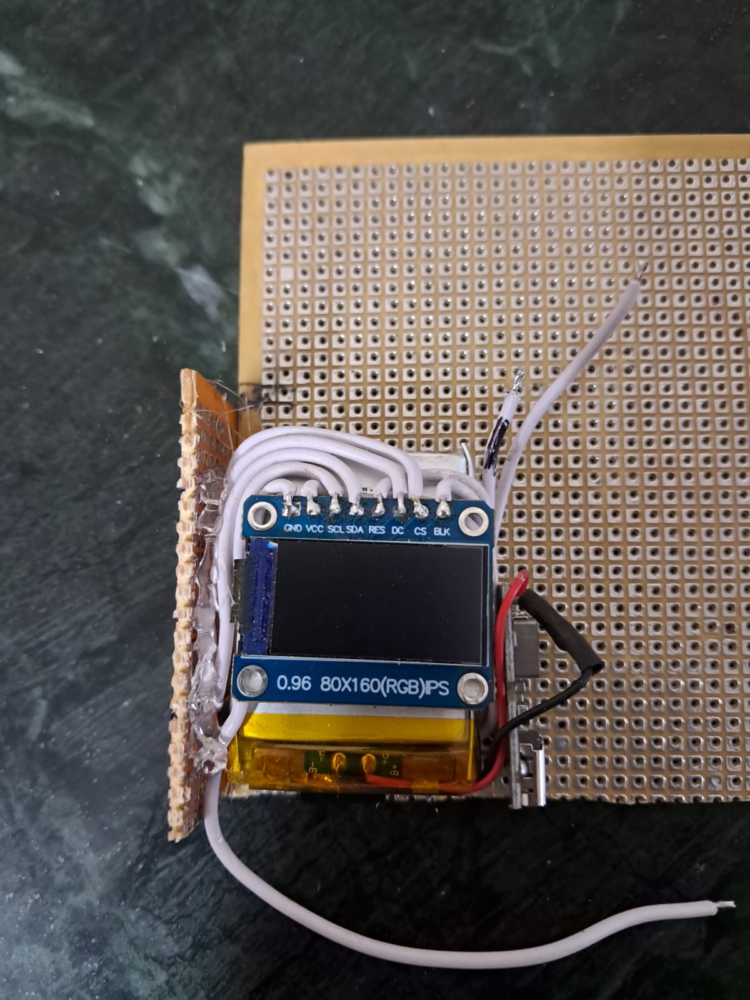
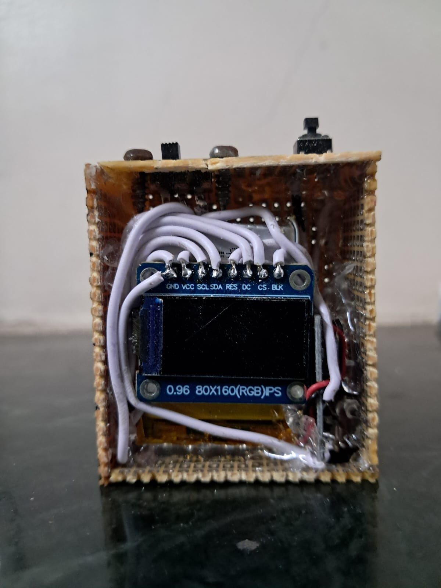

**The main aim of this repository is to help my friend build this camera.**

# CLICKY 📷
 
> A standalone, wireless point-and-shoot camera — built from scratch on an ESP32-CAM module.
 
CLICKY is a DIY digital camera that captures full-resolution JPEG photos to a microSD card, shows a live preview on a small TFT screen, and lets you browse, download, or delete your photos from any phone or laptop browser over WiFi — no app, no internet, no cables required. Firmware can be updated over the air too.
 
---

# Snaps from the camera

<p align="center">
  
  
  
</p>

<p align="center">
  
  
  
</p>

---

## Table of Contents
 
- [What it does](#what-it-does)
- [Hardware you need](#hardware-you-need)
- [Wiring guide](#wiring-guide)
- [Software setup](#software-setup)
- [Partition scheme — important](#partition-scheme--important)
- [Libraries to install](#libraries-to-install)
- [Flashing the firmware](#flashing-the-firmware)
- [How to use CLICKY](#how-to-use-clicky)
  - [Live preview](#live-preview)
  - [Taking a photo](#taking-a-photo)
  - [Grayscale mode](#grayscale-mode)
  - [WiFi gallery mode](#wifi-gallery-mode)
  - [OTA firmware update](#ota-firmware-update)
- [Button behaviour at a glance](#button-behaviour-at-a-glance)
- [The progress bar explained](#the-progress-bar-explained)
- [File naming on the SD card](#file-naming-on-the-sd-card)
- [EEPROM — remembering your settings](#eeprom--remembering-your-settings)
- [Web gallery features](#web-gallery-features)
- [OTA update workflow](#ota-update-workflow)
- [Troubleshooting](#troubleshooting)
- [Technical details](#technical-details)
- [Prototype and Final Project Images](#project-images)
---
 
## What it does
 
| Feature | Detail |
|---|---|
| Live preview | Real-time viewfinder on a 160×80 TFT display |
| Photo capture | Full UXGA (1600×1200) JPEG saved to SD card |
| Grayscale mode | Hardware-level B&W toggle, persists across reboots |
| WiFi gallery | Browse, download, and delete photos from any browser |
| OTA updates | Push new firmware wirelessly — no USB cable needed after first flash |
| No internet needed | Everything runs as a self-contained WiFi access point |
 
---
 
## Hardware you need
 
| Part | Notes |
|---|---|
| ESP32-CAM (AI Thinker) | The main board — includes the OV2640/OV3660 camera |
| FTDI USB-to-Serial adapter (3.3 V) | Only needed for the very first flash |
| 0.96 inch ST7735 TFT display (160×128) | Small colour screen for the viewfinder |
| MicroSD card | FAT32 formatted, 4 GB or smaller recommended |
| Tactile push button | Momentary normally-open button |
| Jumper wires | Male-to-female or male-to-male depending on your setup (Just for prototyping) |
| Breadboard | For assembling everything (Just for prototyping) |
| 1000 mah lipo battery | Not necessarily 1000 mah is required |
| 5V 2A Step-Up Boost Converter with USB Charger | This project uses fm5324ga ic board and is recommended |
| Switch | To turn the setup on and off | 
| Blank/Prototyping PCBs | This project uses prototyping PCBs to make the casing; one can use MDF boards, cardboard, 3D printing, etc |
 
---
 
## Wiring guide
 
### ESP32-CAM → TFT Display (ST7735)
 
The TFT uses SPI. The ESP32-CAM shares SPI pins with the SD card slot, so the CS (chip select) pin is what separates them. As the SD card and display share the same pins, only one of them can be active at any given point. Due to this, video recording is not feasible, as it requires continuous data storage on the SD card and an active display for real-time preview. Refer to the image below.
<p align="center">
  
</p>
 
| TFT Pin | ESP32-CAM GPIO | Notes |
|---|---|---|
| VCC | 3.3 V | Power |
| GND | GND | Power |
| SCL (CLK) | GPIO 4 | SPI clock |
| SDA (MOSI) | GPIO 13 | SPI data |
| RES (RESET) | GPIO -1 | Display reset |
| DC (A0) | GPIO 2 | Data/command select |
| CS | GPIO 12 | **TFT_CS — defined in code** |
| BLK (backlight) | 3.3 V | Tie to 3.3 V for always-on |
 
> The pin numbers above must match your `User_Setup.h` file inside the TFT_eSPI library. See the Software Setup section for details.

> GPIO 4 pin on the ESP32-CAM is used to control the onboard flash (LED). That GPIO is needed for this project and for that the transistor powering the LED is removed.
 
### Button
 
| Button pin | ESP32-CAM GPIO | Notes |
|---|---|---|
| One leg | GPIO 3 (RX0) | Defined as `BUTTON_PIN` in code |
| Other leg | GND | Internal pull-up is enabled in code |
 
> GPIO 3 is the RX0 serial pin, so we cannot use the serial monitor to send commands to the ESP32-CAM. However, we can still receive data from the ESP32-CAM on the serial monitor for debugging

### Power System Wiring

**Battery → Boost/Charger Module**

| Battery | Boost Converter Pin | Notes |
|---|---|---|
| Positive (+) | B+ | Battery positive input |
| Negative (−) | B− | Battery negative input |

**Boost/Charger Module → Switch → ESP32-CAM**

| Boost Converter Pin | Goes to | Notes |
|---|---|---|
| GND (output) | ESP32-CAM GND | Direct connection, no switch |
| 5V (output) | Slide switch — leg 1 | Positive side of the switch |
| Slide switch — leg 2 | ESP32-CAM 5V | Switch in series on the positive line only |

> **Why only the positive line goes through the switch** — it is standard and safe practice to break only the positive wire. The GND stays permanently connected between the module and ESP32-CAM, which is fine and actually helps avoid floating ground issues.

> **USB port on the boost module** — plug any USB-C (or micro-USB depending on your module) cable into it to charge the battery. You do not need to disconnect anything to charge — the module handles charge and output simultaneously.

 
### SD Card
 
The SD card is built into the AI Thinker ESP32-CAM module — you do not need to wire anything for it. Just format your microSD card as FAT32 and insert it.
 
---
 
## Software setup
 
### Step 1 — Install Arduino IDE
 
Download and install Arduino IDE 2.x from [arduino.cc](https://www.arduino.cc/en/software).
I have tested the code on Arduino IDE 2.3.6
 
### Step 2 — Add ESP32 board support
 
1. Open Arduino IDE → **File → Preferences**
2. In the "Additional boards manager URLs" field, paste:
   ```
   https://raw.githubusercontent.com/espressif/arduino-esp32/gh-pages/package_esp32_index.json
   ```
3. Click OK
4. Go to **Tools → Board → Boards Manager**
5. Search for `esp32` and install the package by **Espressif Systems** (version 3.x recommended). I have tested the code on version 3.3.8

### Step 3 — Select the correct board
 
Go to **Tools → Board → ESP32 Arduino** and select:
 
```
AI Thinker ESP32-CAM
```
 
---
 
## Partition scheme — important
 
This is the most important setting and it is easy to miss.
 
The default partition scheme does not have space for OTA updates. You must change it:
 
**Tools → Partition Scheme → Minimal SPIFFS (1.9MB APP with OTA)**
 
This creates two equal app slots so the board can hold a running firmware and a new one at the same time, swapping over safely when an update completes.
 
> If you skip this step, the board will still work but OTA updates will fail silently or corrupt the firmware.
 
Other board settings to check:
 
| Setting | Value |
|---|---|
| Board | AI Thinker ESP32-CAM |
| Upload Speed | 115200 |
| Flash Frequency | 80 MHz |
| Flash Mode | QIO |
| Partition Scheme | Minimal SPIFFS (1.9MB APP with OTA) |
| Core Debug Level | None |
| Port | Your FTDI COM port |
 
---
 
## Libraries to install
 
Go to **Tools → Manage Libraries** and install each of these:
 
| Library | Author | What it does | 
|---|---|---|
| TFT_eSPI | Bodmer | Drives the ST7735 TFT display (version 2.5.43) | 
| esp32-camera | Espressif | Camera driver (usually included with ESP32 board package) | 
 
The following are part of the ESP32 Arduino core and do not need separate installation:
 
- `WiFi.h`
- `WebServer.h`
- `DNSServer.h`
- `Update.h`
- `EEPROM.h`
- `SD_MMC.h`
- `FS.h`
### Configuring TFT_eSPI
 
After installing TFT_eSPI you must edit its configuration file, otherwise the display will not work.
 
1. Find the library folder. On Windows it is usually:
   ```
   C:\Users\YourName\Documents\Arduino\libraries\TFT_eSPI\
   ```
2. Open the file `User_Setup.h` in any text editor
3. Comment out all driver definitions and uncomment only:
   ```cpp
   #define ST7735_DRIVER
   ```
4. Set the colour order as:
   ```cpp
   #define TFT_RGB_ORDER TFT_BGR
   ```
5. Set the display dimensions:
   ```cpp
   #define TFT_WIDTH  128
   #define TFT_HEIGHT 160
   ```
6. Set the type of display (If the below option does not work, try the others):
   ```cpp
   #define ST7735_REDTAB160x80
   ```
7. Set the pin definitions to match the wiring table above:
   ```cpp
   #define TFT_CS   12  // Chip Select
   #define TFT_RST  -1  // Reset
   #define TFT_DC   2   // Data/Command
   #define TFT_MOSI 13  // SPI Data
   #define TFT_SCLK 4  // SPI Clock
   ```
8. Save the file
---
 
## Flashing the firmware
 
You only need the FTDI adapter for this first flash. After this, everything is wireless.
 
### Wiring the FTDI adapter
 
| FTDI pin | ESP32-CAM pin |
|---|---|
| GND | GND |
| VCC (3.3 V) | 3.3 V |
| TX | GPIO 3 (RX0) |
| RX | GPIO 1 (TX0) |
 
To put the ESP32-CAM into flash mode, connect **GPIO 0 to GND** before powering on. You can use a jumper wire. Once flashed, remove that wire and reset the board.
 
### Steps
 
1. Wire up the FTDI as above and connect GPIO 0 to GND
2. Plug the FTDI into your computer
3. Open the project `.ino` file in Arduino IDE
4. Select the correct COM port under **Tools → Port**
5. Click **Upload** (the arrow button)
6. Once you see "Connecting...", press the RST button on the ESP32-CAM if the upload does not start automatically
7. Wait for "Done uploading"
8. Remove the GPIO 0 to GND jumper wire
9. Press RST to restart the board normally
The TFT should light up and show a live camera preview.
 
---
 
## How to use CLICKY
 
### Live preview
 
As soon as the board starts, the TFT display shows a live viewfinder from the camera. The preview runs at QQVGA resolution (160×120) to keep it smooth. No button press is needed — it just runs.
One important thing is that the display has a resolution of 80×160, while the live preview is at QQVGA (120×160). Due to this mismatch, 40 lines of data are not visible in the live preview but are still captured and saved on the SD card. In landscape mode, 20 lines of data from the top and 20 lines from the bottom are removed, and the preview is centred.
 
### Taking a photo
 
Press the button briefly (less than 3 seconds) and release it. The display will show "Capturing..." and the board saves a full-resolution JPEG to the SD card, then restarts and returns to the live preview. The capturing process takes approximately 6 seconds because the camera deinitialises from the QQVGA (160x120) resolution and reinitialises to UXGA (1600x1200). Photos are saved as `pic1.jpg`, `pic2.jpg`, and so on — the board finds the next available number automatically.
 
### Grayscale mode
 
CLICKY supports a hardware grayscale mode using the OV2640/OV3660 camera sensor's built-in effect engine. This means the grayscale conversion happens inside the camera chip itself before the image is even processed — it costs nothing and works at full resolution.
 
**To toggle grayscale on or off:**
 
Press and hold the button until the progress bar on screen turns blue (between 3 and 5 seconds), then release. The board will restart in the new mode.
 
- If you were in colour mode, it switches to grayscale
- If you were in grayscale, it switches back to colour
The selected mode is saved to EEPROM (a tiny persistent memory chip on the board) so it survives power cuts and restarts. Every time CLICKY boots, it reads the saved mode and applies it automatically.
 
When grayscale is active, the live preview on the TFT and all captured photos will be in black and white.
 
### WiFi gallery mode
 
Press and hold the button for 5 seconds or more (until the progress bar turns green), then release. The board starts a WiFi access point.
 
**To access your photos:**
 
1. On your phone or laptop, open WiFi settings
2. Connect to the network named **CLICKY** (no password)
3. Open any web browser
4. Type `192.168.4.1` in the address bar, or just try opening any website — the captive portal will redirect you automatically
5. The gallery page will load showing all photos on the SD card
### WiFi gallery features
 
Once in the gallery:
 
- **View** — all photos load as thumbnails on the page
- **Download selected** — tick the photos you want and tap "Download selected"
- **Delete selected** — tick photos and tap "Delete selected" to remove them from the SD card
- **Delete all** — removes every photo from the SD card in one go (asks for confirmation)
- **Stop WiFi** — exits WiFi mode and restarts the board, returning to camera mode

Note: On iOS devices, the gallery page may open automatically when connected to Wi-Fi, but the download feature might not work. In this case, close the gallery page, open a browser like Google Chrome, and manually enter the IP address mentioned above to download the images.

### OTA firmware update
 
When in WiFi mode, you (and only you, with the password) can push new firmware wirelessly.
 
1. Connect to the CLICKY WiFi network
2. Open your browser and go to `http://192.168.4.1/update`
3. Your browser will ask for a username and password:
   - Username: `admin`
   - Password: `changeme123` *(change this in the source code before flashing)*
4. Drag your new `.bin` firmware file onto the page, or click to browse for it
5. Click **Flash firmware**
6. A progress bar shows the upload. When done, the board restarts automatically with the new firmware
> **Where to get the `.bin` file:** In Arduino IDE, go to **Sketch → Export Compiled Binary**. It saves a file ending in `.ino.bin` in the same folder as your sketch. That is the file to upload — not the `.merged.bin` or `.bootloader.bin`.
 
> **Critical rule:** Every firmware version you flash must include the OTA code. If you flash a version without it, you will lose the ability to do wireless updates and will need the FTDI cable again.
 
---
 
## Button behaviour at a glance
 
| Press duration | What happens |
|---|---|
| 0 – 3 seconds | Short press — takes a photo |
| 3 – 5 seconds | Toggle press — switches grayscale on or off, then restarts |
| 5+ seconds | Long press — starts WiFi gallery mode |
 
---
 
## The progress bar explained
 
When you press and hold the button, a progress bar appears on the TFT screen. The colour tells you which action will trigger when you release:
 
| Bar colour | Time range | Release action |
|---|---|---|
| Yellow | 0 – 3 seconds | Capture photo |
| Blue | 3 – 5 seconds | Toggle grayscale |
| Green | 5+ seconds | Start WiFi mode |
 
The text label above the bar also updates:
 
- **"Hold for toggle..."** — in the blue zone, release here to toggle grayscale
- **"Hold for WiFi..."** — in the green zone, release here for WiFi mode
If you release the button while the bar is still yellow (under 3 seconds), the photo is taken immediately.
 
---
 
## File naming on the SD card
 
Photos are saved in the root directory of the SD card as:
 
```
pic1.jpg
pic2.jpg
pic3.jpg
...
```
 
The board scans for the lowest available number each time it captures, so there are no overwrites and no gaps caused by deleted files being reused immediately.
 
---
 
## EEPROM — remembering your settings
 
The board uses 1 byte of EEPROM to store the active camera effect:
 
- `0` = normal colour mode
- `2` = grayscale mode (value `2` matches the OV2640/OV3660 sensor's effect index)
Every time you toggle grayscale, the new value is written to EEPROM address 0. Every time the board boots, it reads this address and applies the effect before starting the preview. This means your preferred mode is always preserved even if the board loses power.
 
---
 
## Web gallery features
 
The gallery page is a self-contained single-page app served directly from the ESP32's flash memory. It requires no internet connection and works in any modern browser, such as Google Chrome.
 
Features:
 
- Responsive grid layout — works on phones, tablets, and desktops
- Lazy loading thumbnails — images load as you scroll
- Multi-select with checkboxes — tap a photo to select it
- Batch download — selected photos download one by one
- Batch delete — removes selected photos from SD with confirmation
- Delete all — one-tap wipe with confirmation dialog
- Toast notifications — brief on-screen feedback for actions
- Dark mode aware — follows your system preference automatically
---
 
## OTA update workflow
 
Here is the complete workflow for pushing a code change without a cable:
 
1. Make your changes in Arduino IDE
2. Go to **Sketch → Export Compiled Binary** — wait for compilation
3. Find the `.ino.bin` file in your sketch folder (not `.merged.bin`)
4. Power on CLICKY
5. Hold the button for 5+ seconds → connect to CLICKY WiFi
6. Go to `http://192.168.4.1/update` in your browser
7. Log in with your credentials
8. Drag the `.bin` file onto the page → click Flash
9. Wait for the board to restart
10. Confirm the new firmware is running (check serial output or test new features)
---
 
## Troubleshooting
 
**1) Display shows nothing / stays black**
 
Check your `User_Setup.h` pin definitions in the TFT_eSPI library. The most common cause is the CS, DC, or RST pins being wrong. Also confirm your wiring matches exactly.
 
**2) Camera FAILED!" on screen at boot**
 
The camera failed to initialise. This can happen if the board loses power during a previous frame capture. Restart the camera. If it persists, check that the camera ribbon cable on the AI Thinker module is fully seated.
 
**3) SD card not detected during capture**
 
Make sure the SD card is FAT32 formatted and is 4 GB or smaller. ExFAT and NTFS are not supported. Try reformatting the SD card.
 
**4) WiFi network "CLICKY" does not appear**
 
Confirm the board has fully booted (display shows WiFi mode screen). The AP can take a few seconds to appear after the board starts.
 
**5) OTA page asks for password but won't accept it**
 
Make sure you are typing the credentials exactly as defined in the source code (`OTA_USERNAME` and `OTA_PASSWORD`). Some browsers cache a failed login — try an incognito/private window.
 
**6) OTA upload fails halfway**
 
The `.bin` file may be too large for the partition scheme you selected. Confirm you are using "Minimal SPIFFS (1.9MB APP with OTA)" and that the sketch size is under 1.9 MB (check the output panel in Arduino IDE after compiling).
 
**7) Photos are all black or very dark**
 
This can happen if auto-exposure has not had time to adjust when the capture is triggered. The code already discards two warm-up frames before saving. If it persists, try capturing in better lighting.
 
**8) Button does nothing**

Check the button wiring — one leg to GPIO 3, the other to GND.
 
---
 
## Technical details
 
| Property | Value |
|---|---|
| Microcontroller | ESP32-S (dual-core 240 MHz) |
| Camera sensor | OV2640/OV3660 |
| Preview resolution | QQVGA 160×120 RGB565 |
| Capture resolution | UXGA 1600×1200 JPEG (with PSRAM), SVGA fallback |
| Display | 0.96 inch ST7735 160×128 TFT via SPI |
| Storage | MicroSD via SD_MMC (1-bit mode) |
| WiFi | 802.11 b/g/n, AP mode only |
| AP IP address | 192.168.4.1 |
| OTA method | HTTP multipart upload via ESP32 Update library |
| EEPROM usage | 1 byte at address 0 (camera effect index) |
| Flash size | 4 MB |
| PSRAM | 4 MB (used for large frame buffers) |
| Partition scheme | Minimal SPIFFS — two 1.875 MB OTA app slots |

## Project images
<p align="center">
  
  
  
</p>

<p align="center">
  
  
  
</p>

---

> [!IMPORTANT]
> When prototyping on a breadboard, use short jumper cables and ensure all connections are secure. Poor-quality wires or loose connections can cause the display to render incorrectly, often showing distorted colors such as green or yellow across the image. Soldering the connections as shown in the above image is recommended.

---
 
*A photo is forever.*
